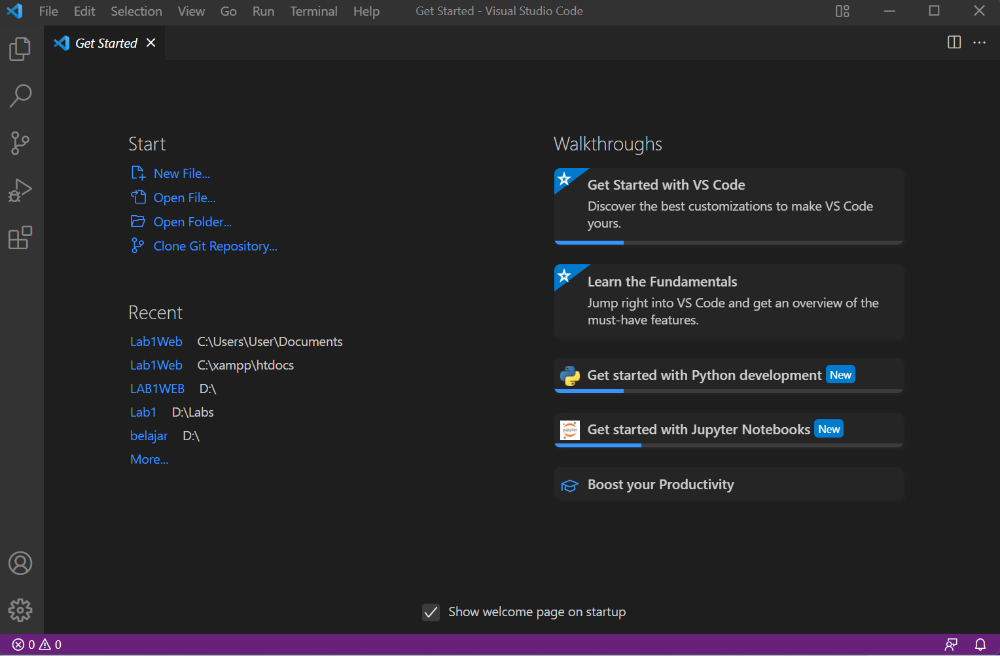

# Praktikum 4: CSS Layout

<strong>Repository ini dibuat untuk memenuhi tugas Pemrograman Web</strong>
| <strong>Nama</strong>      | <strong>Riris Naomi Gurning</strong>  |
| ----------- | ----------- |
| <strong>NIM</strong>     | <strong>312010190</strong>       |
| <strong>Kelas</strong>   | <strong>TI.20.A.1</strong>        |

# Langkah-langkah Praktikum 4 "CSS Layout"

1. Pertama - tama membuka VSCode
 

2. <mark>Kemudian membuat dokumen HTML dengan nama <b><i>file lab4_box.html</i></b></mark>
 

3. <mark>Kemudian tambahkan kode untuk membuat box element dengan tag div seperti berikut.</mark>
 

4. <mark>Selanjutnya tambahkan deklarasi CSS pada head untuk membuat float element, seperti berikut.</mark>
 
Ini hasil di Microsoft Edge

 

5. Mengatur Clearfix Element
Clearfix digunakan untuk mengatur element setelah float element. Property clear digunakan untuk mengaturnya.
 Tambahkan element div lainnya seteleah div3 seperti berikut. 
 
Ini hasil di Microsoft Edge

 
