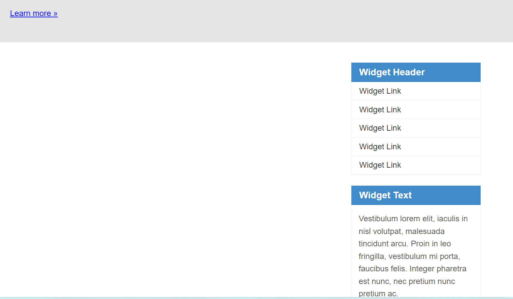

# Praktikum 4: CSS Layout

<strong>Repository ini dibuat untuk memenuhi tugas Pemrograman Web</strong>
| <strong>Nama</strong>      | <strong>Riris Naomi Gurning</strong>  |
| ----------- | ----------- |
| <strong>NIM</strong>     | <strong>312010190</strong>       |
| <strong>Kelas</strong>   | <strong>TI.20.A.1</strong>        |

# Langkah-langkah Praktikum 4 "CSS Layout"

1. Pertama - tama membuka VSCode
 

2. Kemudian membuat dokumen HTML dengan nama <b><i>file lab4_box.html</i></b>
 

3. Kemudian tambahkan kode untuk membuat box element dengan tag div seperti berikut.
 

4. Selanjutnya tambahkan deklarasi CSS pada head untuk membuat float element, seperti berikut.
 
Ini hasil di Microsoft Edge

 

5. Mengatur Clearfix Element
Clearfix digunakan untuk mengatur element setelah float element. Property clear digunakan untuk mengaturnya.
 Tambahkan element div lainnya seteleah div3 seperti berikut. 
 
Kemudian atur property clear pada CSS, seperti berikut.

 
Ini hasil di Microsoft Edge

 
 Saya melakukan eksperimen terhadap penggunaan property clear dengan nilai lainnya (left, both, right), dan amati perubahannya. 
 
 
Yang terjadi perubahan adalah right, tampilannya seperti berikut:

 

6. Langkah selanjutnya Membuat Layout Sederhana Buat folder baru dengan nama lab4_layout, kemudian buatlah file baru didalamnya dengan nama home.html, dan file css dengan nama style.css. 
  Kemudian tulis kode berikut. 
  Inilah hasilnya: 
 

7. Kemudian tambahkan kode CSS untuk membuat layoutnya.
   
 

8. Langkah selanjutnya mengatur navigasi.
  Kemudian lihat hasilnya. 
 

9. Kemudian Selanjutnya membuat hero panel. Tambahkan kode HTML 
  Tambahkan kode CSS 
 
Dan inilah hasilnya:

 

10. Langkah selanjutnya mengatur main content dan sidebar, tambahkan CSS float. 
 

11. Kemudian selanjutnya menambahkan element lain dalam sidebar.
  Kemudian tambahkan CSS. 
 

12. Langkah selanjutnya mengatur tampilan footer. Tambahkan CSS untuk footer.
 
Dan inilah hasilnya:

 

13. Menambahkan Elemen lainnya pada Main Content
